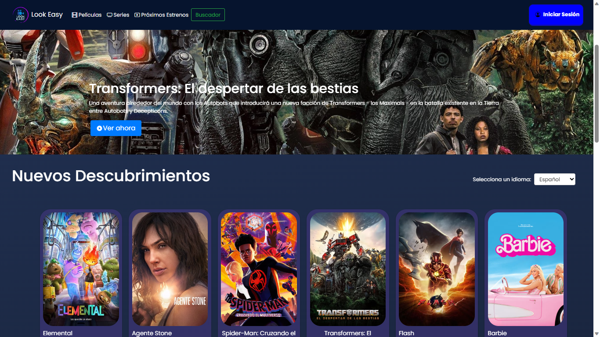
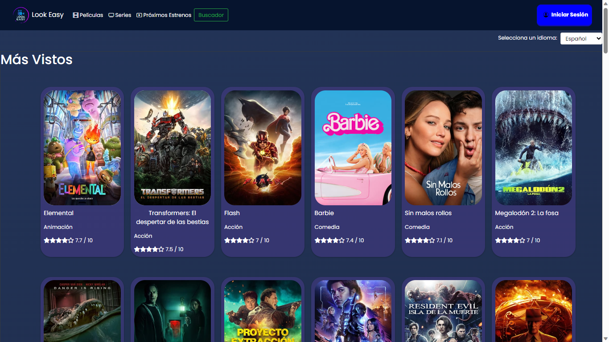
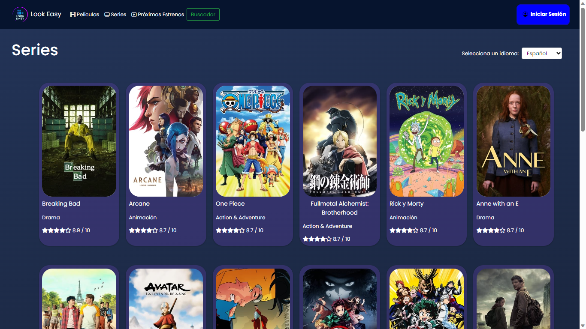
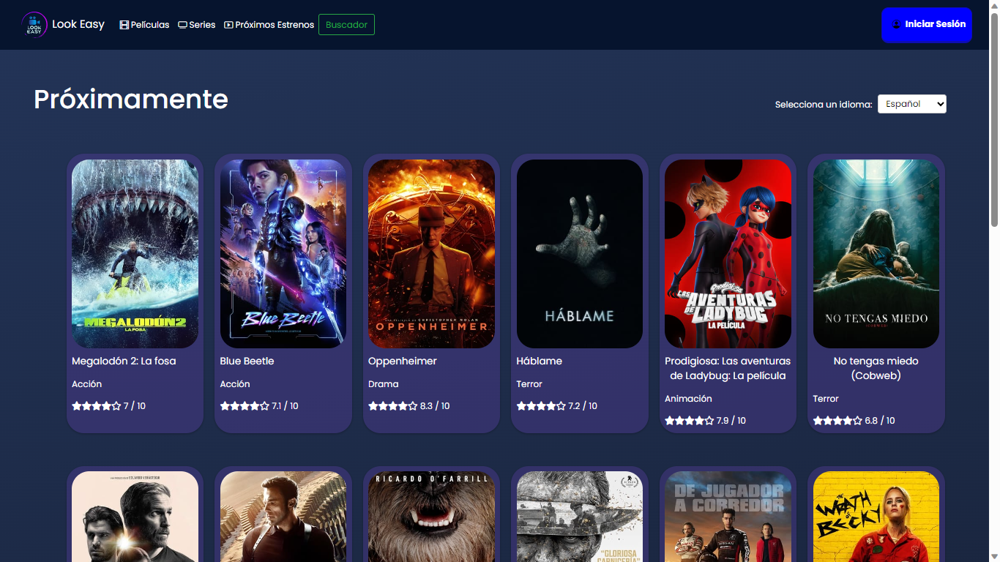
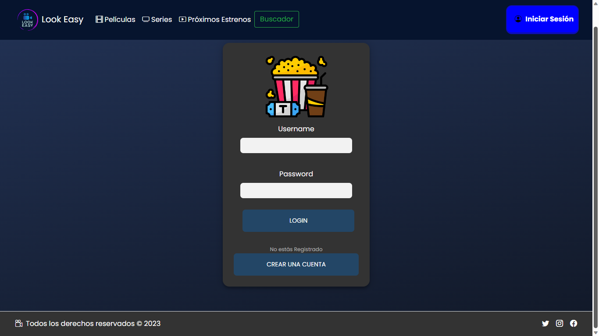
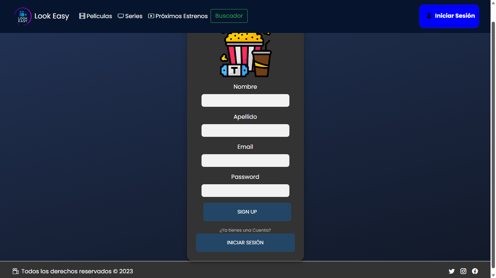
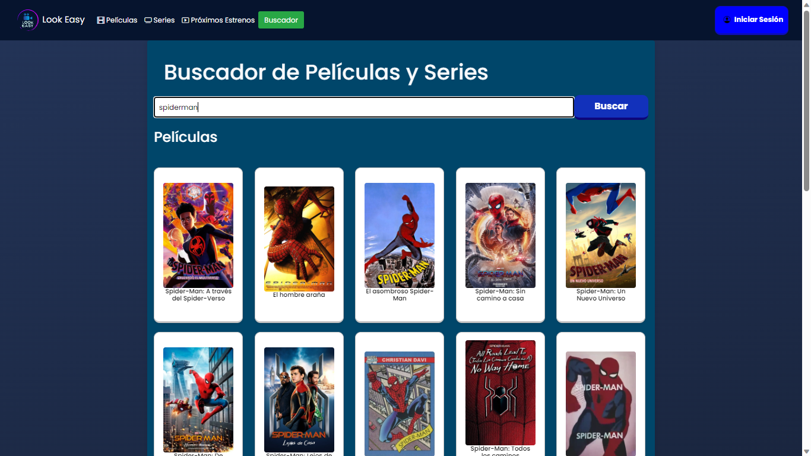

# Look-Easy - Página de Películas 💻🎥

## Índice

1. [Descripción](#descripción)
2. [Características](#características)
   - [Lenguajes y Tecnologías Utilizadas](#lenguajes-y-tecnologías-utilizadas)
3. [Capturas de Pantalla](#capturas-de-pantalla)
   - [Página de Inicio](#página-de-inicio)
   - [Página de Película](#página-de-película)
   - [Página de Series](#página-de-series)
   - [Página de Estrenos](#página-de-estrenos)
   - [Página de Iniciar Sesión](#página-de-iniciar-sesión)
4. [Tareas por Cumplir](#tareas-por-cumplir)
5. [Instalación](#Instalación-y-ejecución)
6. [Contribuidores](#contribuidores)
7. [Contacto](#contacto)

## Descripción

Look-Easy es una página de películas que ofrece una amplia selección de películas de diferentes géneros para disfrutar. Este repositorio contiene el código fuente de la página de películas Look Easy.

## Características 🎞️

- Amplia selección de películas.
- Interfaz intuitiva y fácil de usar.
- Búsqueda rápida y eficiente de películas.
- Información detallada de cada película, incluyendo imágenes y descripciones.
- Reseñas y calificaciones de usuarios.
- Opción para crear listas de películas favoritas.
- Recomendaciones personalizadas basadas en las preferencias del usuario.
- Actualizaciones regulares con nuevos lanzamientos y contenido adicional.

### Lenguajes y Tecnologías Utilizadas

-  HTML5
-  CSS3
-  JavaScript
-  Bootstrap
-  jQuery
-  React
-  Spring

## Capturas de Pantalla 📷

### Página de Inicio


La página de inicio muestra una selección destacada de películas y ofrece una interfaz intuitiva para navegar y buscar películas según los gustos del usuario.

### Página de Película


En la página de la película, los usuarios pueden encontrar información detallada sobre la película, incluyendo su título, descripción y características. También pueden ver una imagen representativa de la película para tener una idea visual de su contenido.

### Página de Series


Descripción: Esta página permite a los usuarios explorar una amplia selección de series de televisión.
<details>
  <summary><strong>Tareas por Cumplir</strong></summary>

-   [ ] Agregar la opción de clasificar las series por género.
-   [ ] Implementar una función de reproducción de episodios.
</details>

### Página de Estrenos


Descripción: En esta página, los usuarios pueden descubrir las últimas películas que han sido estrenadas.
<details>
  <summary><strong>Tareas por Cumplir</strong></summary>

-   [x] Mostrar información adicional sobre cada película en la página de estrenos.
-   [ ] Implementar una función de notificación para nuevos estrenos.
</details>

### Página de Iniciar Sesión



Descripción: Estas páginas permiten a los usuarios iniciar sesión o registrarse para acceder a funciones adicionales como crear listas de películas favoritas y dejar reseñas.
<details>
  <summary><strong>Tareas por Cumplir</strong></summary>

-   [ ] Implementar la funcionalidad de registro con cuentas de redes sociales.
</details>

### Página de Iniciar Sesión


Descripción: Estas páginas permiten a los usuarios realizar búsquedas personalizadas de contenido
## Tareas por Cumplir ✅

<details>
  <summary><strong>Ver Tareas</strong></summary>

- [x] Mejorar la interfaz de usuario para una experiencia más atractiva.
- [x] Implementar la función de búsqueda avanzada para facilitar la búsqueda de películas por género, año, etc.
- [x] Añadir la opción de ver trailers de películas.
- [ ] Desarrollar la funcionalidad de crear listas personalizadas de películas.
- [ ] Mejorar el rendimiento y la optimización del código.
</details>

# Instalación y ejecución

Sigue estos pasos para clonar y ejecutar localmente este proyecto basado en React:

1. Clona este repositorio

Abre tu terminal y ejecuta el siguiente comando:
```bash
   git clone <URL_del_repositorio>
   ```
Reemplaza `<URL_del_repositorio>` con la URL real de tu repositorio de GitHub.

2. Navega al directorio del proyecto

Ingresa al directorio del proyecto que acabas de clonar:
```bash
   cd <nombre_del_directorio>
   ```

Cambia <nombre_del_directorio> por el nombre del directorio que se creó después de clonar el repositorio.

3. Instala las dependencias

Asegúrate de tener Node.js y npm instalados en tu sistema. Luego, ejecuta el siguiente comando para instalar las dependencias del proyecto:

```bash
   npm install
   ```

4. Inicia la aplicación

Una vez que las dependencias estén instaladas, puedes ejecutar la aplicación con el siguiente comando:

```bash
   npm start
```

Esto iniciará un servidor de desarrollo y abrirá automáticamente la aplicación en tu navegador web predeterminado.

5. Explora la aplicación
Ahora deberías ver la aplicación React en tu navegador. ¡Puedes comenzar a explorar y probar sus características!

## Contribución 👥

Si deseas contribuir a este proyecto, sigue los pasos a continuación:

1. Realiza un fork de este repositorio.
2. Crea una nueva rama (`git checkout -b feature/nueva-funcionalidad`).
3. Realiza los cambios necesarios y commitea tus modificaciones (`git commit -am 'Agrega nueva funcionalidad'`).
4. Pusha tus cambios hacia la rama (`git push origin feature/nueva-funcionalidad`).
5. Abre una solicitud de extracción en GitHub.

### Contribuidores

- [SebastianJer07](https://github.com/SebastianJer07)

## Contacto 📧

Si tienes alguna pregunta, sugerencia o inquietud relacionada con el repositorio "Look-Easy - Página de Películas", no dudes en ponerte en contacto con el propietario y contribuidor principal:

- Nombre: JuanE-Gil
- Perfil de GitHub: [JuanE-Gil](https://github.com/JuanE-Gil)
- Correo electrónico: JuanE.Gil2002@Gmail.com
- Instagram: [@JuanEGil](https://www.instagram.com/juane.gil02/) 📷

¡Estoy aquí para ayudarte en lo que necesites! No dudes en contactarme.

¡Esperamos que disfrutes de tu experiencia en Look-Easy y encuentres las mejores películas para ver! 🎉🍿
